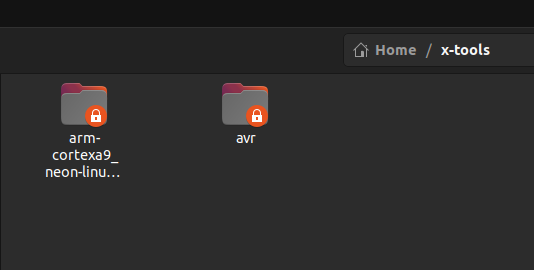
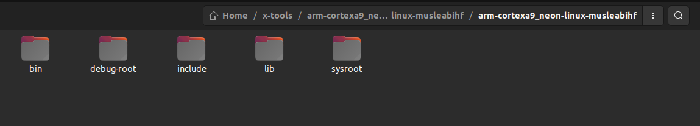
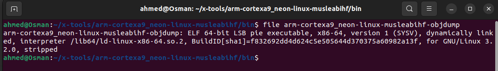
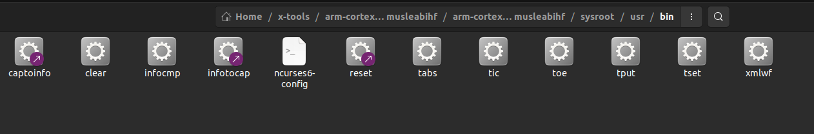

## Sysroot

After building the toolchain for the arm cortex a9 using **crosstool-ng**, this toolchain is now inside the **xtool** directory.

Inside the **arm-cortexa9** there are some directories and among these there is the **sysroot** directory. This directory represents the **root** directory that will be on the target.

## Binutil

The bin utilities are some tools that help us in development such as **objdump , strings, strip...etc** 

After building the **arm-cortexa9** toolchain we can find many of the binutils inside the bin folder and these **bnutils** are made to deal with executable files that are going to run on arm-cortex-a9 only and not any other architecture that's why they're preceded with **arm-cortexa9_.....** . But that **DOESN'T** mean we can run them **ON**  the **arm-cortexa9** target as these **binutils** themselves are **x86-64** executables.

Inside the **sysroot** there are some binaries but we won't find the any of the **binutil** such as the once mentioned above. 

